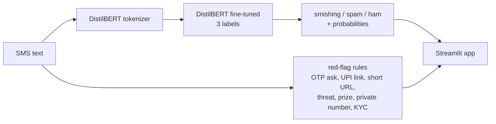

# Scam Shield

[](https://github.com/VivekVagale/scam-shield/actions/workflows/tests.yml)

**Paste an SMS, find out if it is a scam.** A fine-tuned DistilBERT model sorts
messages into **smishing** (phishing by SMS: fake KYC, bill, courier, prize,
job offers), **spam** (unwanted promotion) or **ham** (legitimate), and plain
rules point out the warning signs so the user learns *why*.

**Live demo: https://vivekvagale.github.io/scam-shield/** : the model runs
inside your browser (ONNX, 67 MB, downloaded once), so messages never leave
your device.

India loses thousands of crores a year to SMS and call fraud, and the messages
are written to look like the bank alerts people get every day. The hard part
is not catching scams; it is catching them **without** flagging real OTPs and
UPI alerts.

## Results

Test set: 870 held-out messages from the public dataset.
India set: 60 synthetic Indian-style messages (see [eval/README.md](eval/README.md)), never trained on.

| Model | Test macro F1 | Test scams caught | Test false alarms | India macro F1 | India scams caught | India false alarms |
|---|---|---|---|---|---|---|
| TF-IDF + logistic regression | 0.919 | 131/144 | 0/726 | 0.695 | 29/35 | 9/25 |
| TF-IDF + LR, + Indian augment | 0.915 | 130/144 | 1/726 | 0.769 | 28/35 | 5/25 |
| DistilBERT | 0.906 | 139/144 | 4/726 | 0.720 | **35/35** | 11/25 |
| **DistilBERT + Indian augment** | **0.925** | **140/144** | 3/726 | **0.832** | 32/35 | **2/25** |
| DistilBERT + augment + critical rules | 0.925 | 140/144 | 3/726 | 0.847 | 33/35 | 2/25 |
| same, int8 ONNX (the web demo) | 0.916 | 141/144 | 4/726 | | | |

"Scams caught" counts spam + smishing flagged as either; "false alarms" are
legitimate messages flagged as either.

**What the numbers say**

- DistilBERT catches more scams than the keyword baseline (97% vs 91%), at the
  cost of a few false alarms.
- Both models trained on the public data flag Indian bank alerts, OTPs and
  delivery updates as spam: the dataset has almost none, so "sounds like a
  company" was learned as "spam".
- Adding 458 template-generated Indian messages to training cut India false
  alarms from 11 to 2 **and** improved the original test set, so it did not
  just overfit to India-style text.

## What still fails

- **Hinglish** ("Aapka bijli connection aaj raat kaat diya jayega…") gets through. The tokenizer is English-only.
- **"Share the OTP to get your refund"** fooled the model: the augmented data
  taught it "OTP message = safe". Fix: two *critical* rules (asks you to share
  an OTP/PIN, or sends a UPI pay link) override a "safe" verdict, because
  legitimate messages never do either. On the 870-message test set this
  changed 0 verdicts (no new false alarms). It fixes that India miss, but the
  rule was written after seeing it, so that gain is not independent evidence.
- Some real bank debit alerts ("…Not you? Call…") are still called spam.
- The India set is synthetic and written by the same person as the augment
  templates, so its gains are optimistic. The next step is a set of **real**
  forwarded scam SMS (`eval/india_real.csv`); the evaluator picks it up automatically.

## Run it

```powershell
uv venv --python 3.11 .venv
.venv\Scripts\activate
uv pip install torch --index-url https://download.pytorch.org/whl/cu126
uv pip install -r requirements.txt

python -m src.data                 # download (245 KB), clean, split 70/15/15
python -m src.augment              # generate the Indian training messages
python -m src.baseline --augment   # seconds, CPU
python -m src.finetune --augment   # ~2 min on an RTX 4060
python -m src.evaluate             # every model on every test set
streamlit run app.py               # the demo (Python)
python -m src.export_onnx          # int8 ONNX for the browser demo in web/
python -m pytest
```

Drop `--augment` to train the plain versions for comparison.

## How it works



- `src/data.py` downloads and cleans the data: lowercases labels, drops 34
  messages that appear with two different labels, removes 106 duplicates so no
  message sits in both train and test, then splits 70/15/15 with a fixed seed.
- `src/baseline.py` word + character n-gram TF-IDF into a class-balanced logistic regression.
- `src/finetune.py` fine-tunes `distilbert-base-uncased` for 4 epochs with a
  class-weighted loss, keeps the epoch with the best validation F1, and scores
  the test set once.
- `src/augment.py` template generator for Indian transactional ham and smishing.
- `src/evaluate.py` scores every trained model on the test split and every CSV in `eval/`.
- `src/redflags.py` seven regex rules, each with a one-line explanation for the user.
- `src/export_onnx.py` exports to ONNX and quantizes weights to 8-bit integers:
  268 MB to 67 MB, and it agrees with the full model on 99.5% of test messages.
- `web/index.html` the browser demo: transformers.js runs the ONNX model client-side; the red-flag rules are ported to JavaScript.

More detail and the reasons behind each choice: [docs/INTERVIEW_NOTES.md](docs/INTERVIEW_NOTES.md).

## Data

Mishra, S. & Soni, D. (2022). *SMS Phishing Dataset for Machine Learning and
Pattern Recognition*. Mendeley Data, V1. DOI: 10.17632/f45bkkt8pr.1.
Downloaded by the code, not redistributed here.

## Author

**Vivek Vagale** - [@VivekVagale](https://github.com/VivekVagale)
